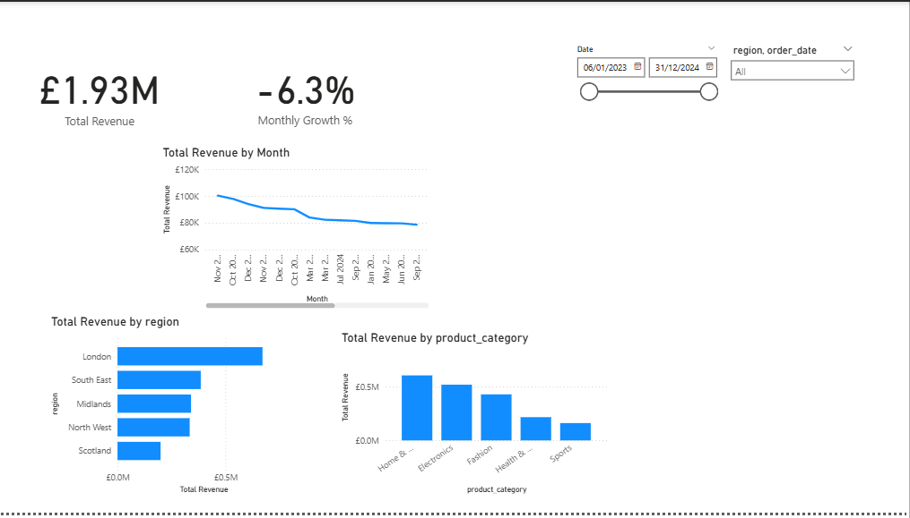
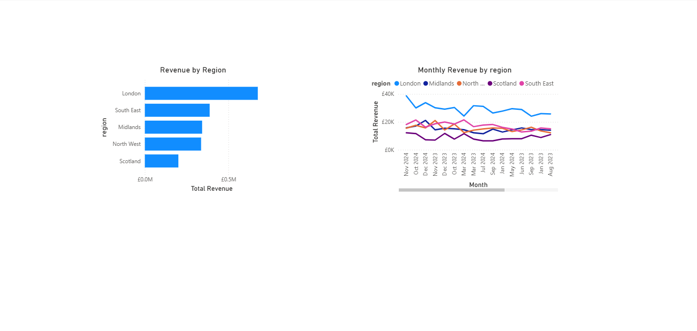
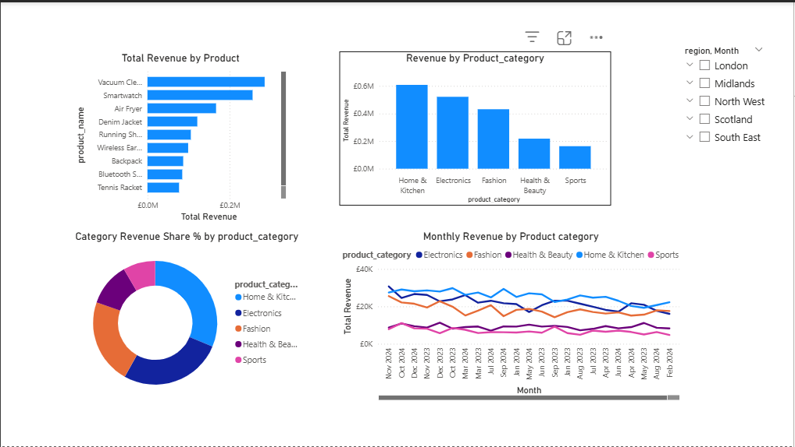

# 📊 Sales Performance & Revenue Analysis Dashboard

## Project Overview

This project analyzes historical sales data to evaluate revenue performance across regions, products, and time. The objective is to provide stakeholders with clear, actionable insights through an interactive Power BI dashboard that supports data-driven sales and marketing decisions.

---

## Business Objective

The business needed a single source of truth to:

* Track total revenue and growth trends
* Compare performance across regions
* Identify top-performing and underperforming products
* Detect seasonal patterns impacting sales

---

## Dataset

* **Source:** Public retail sales dataset (educational use)
* **Size:** ~500,000 records
* **Key Fields:**

  * Order Date
  * Region
  * Product Name
  * Product Category
  * Revenue

The dataset was cleaned and validated before analysis.

---

## Dashboard Features

### Executive Overview

* Total Revenue
* Month-over-Month Revenue Growth (%)
* Top Performing Region
* Top Product Category

### Regional Performance

* Revenue by Region
* Monthly Revenue Trends by Region

### Product Performance

* Top 10 Products by Revenue
* Revenue Contribution by Product Category

### Interactivity

* Date slicers for time-based analysis
* Region filters for geographic comparison
* Product category filters for product-level insights

---

## Key Insights

* One region generated approximately **35% of total revenue**, while another consistently underperformed.
* Clear **seasonal sales spikes in Q4** indicate strong holiday-driven demand.
* Around **60% of total revenue** was generated by a small subset of products, highlighting revenue concentration risk.


---

## Business Recommendations

* Increase sales and marketing investment in high-performing regions to maximize return on investment.
* Investigate pricing, logistics, or demand-related issues in underperforming regions.
* Diversify the product portfolio to reduce dependency on a small number of products.

---

## Skills Demonstrated

* SQL-based data analysis and KPI calculation
* Data cleaning and validation
* Revenue and trend analysis
* Power BI dashboard design and data visualisation
* Translating analytical insights into business-focused recommendations

---

The sql/ directory contains all KPI calculations and analysis queries used to generate the dashboard insights.


## Dashboard Preview

### Executive Overview


### Regional Performance


### Product Performance



## Repository Structure

```
sales-performance-analysis/
│
├── data/
│   ├── raw_sales_data.csv
│   ├── cleaned_sales_data.csv
│
├── sql/
│   ├── data_cleaning.sql
│   ├── kpi_calculations.sql
│   ├── revenue_analysis.sql
│
├── notebooks/
│   ├── exploratory_data_analysis.ipynb
│
├── powerbi/
│   ├── sales_dashboard.pbix
│   ├── dashboard_screenshots/
│
├── README.md

    

```

Detailed SQL queries and analysis logic can be found in the `sql/` directory, while the Power BI dashboard and screenshots are available in the `powerbi/` directory.
